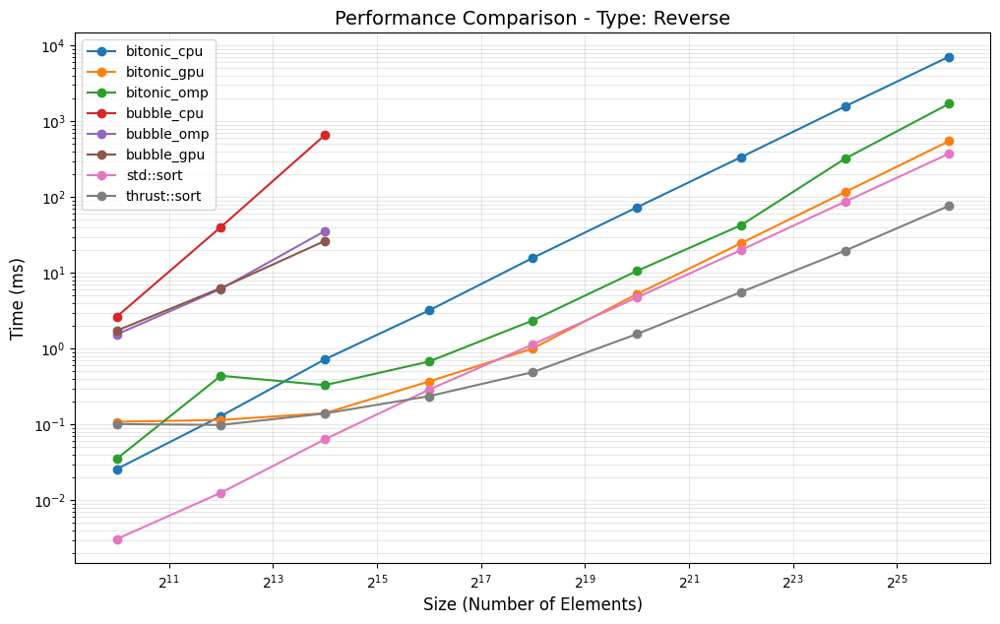
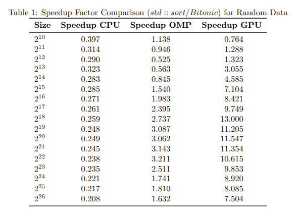
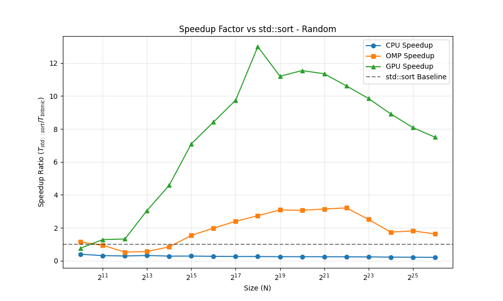
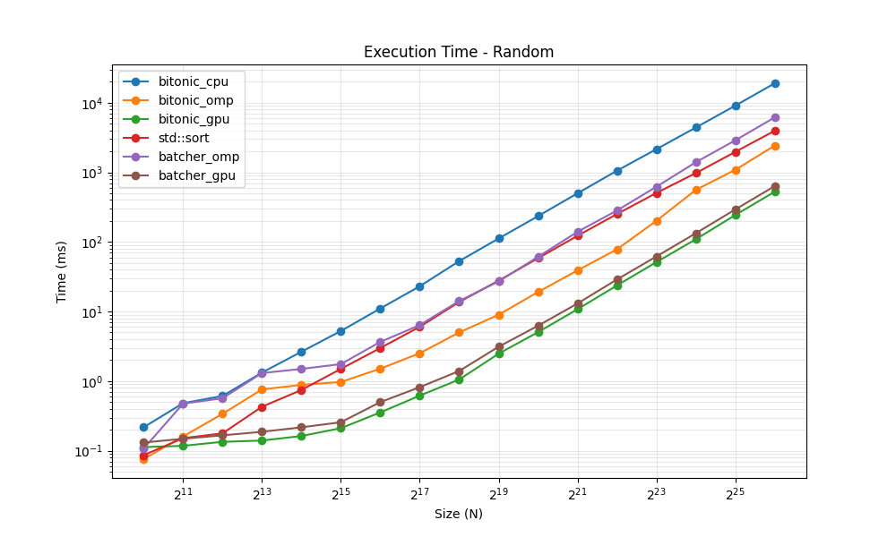
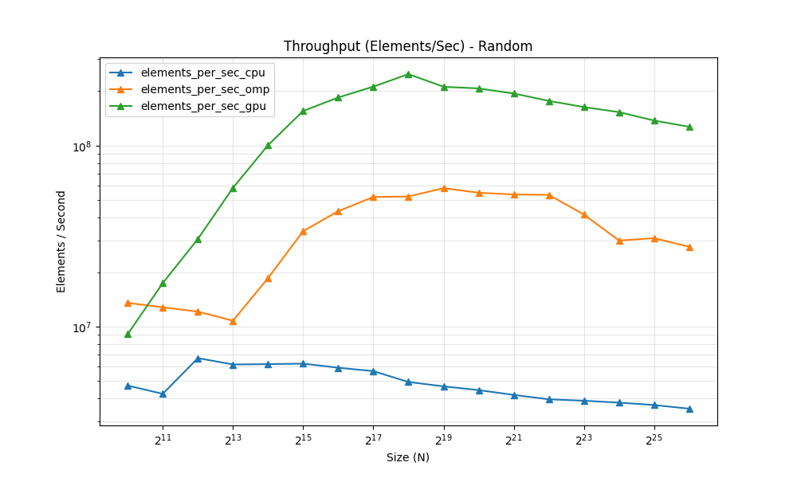
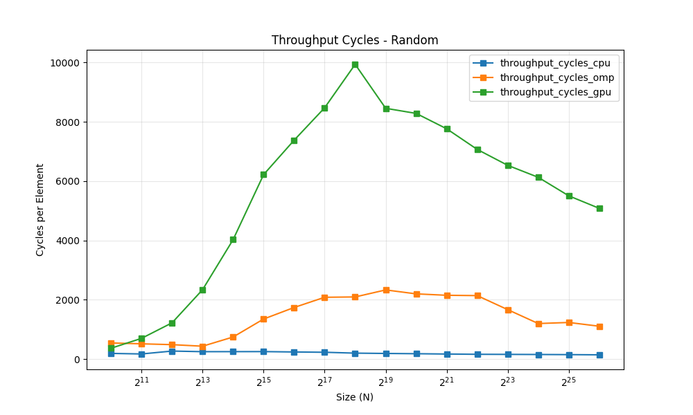
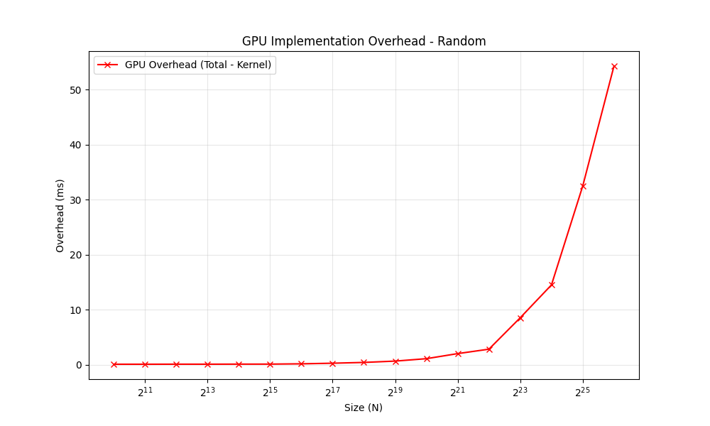

# Bitonic Sort
> [三十分钟理解：双调排序Bitonic Sort，适合并行计算的排序算法](https://blog.csdn.net/xbinworld/article/details/76408595)

- 排序一個長度為 $2^k$ 的 單調續列：
	- 對於長度為 $2^k$ 的雙調序列，共做 $k$ 輪操作。
操作如下：設第 $i$ 輪操作時序列長度為 $2n=2^{k-i}$, $k=\{0, 1, 2, ..., k-1\}$。
按序比較 $a_i$ 與 $a_{i+n}$ ， 建造兩個陣列 $a_{max} = \{\max a_i, a_{i+n} \mid i = 1, 2, ..., n-1\}$, $a_{min} = \{\min a_i, a_{i+n} \mid i = 1, 2, ..., n-1\}$ ，把 $a_{min}$ 置於 $a_{max}$ 前。
這兩個陣列都滿足雙調，根據Batcher定理。
做完 $k$ 輪操作後得到一個升序序列。
- 將任意序列變成單調序列
	- bitonic merge 從`n=2`開始與鄰居構建單調序列（任意兩個元素一定能構成單調序列
- 將任意長度轉換成2的冪次方
	- 一个直观的方法就是使用padding。即使用一个定义的最大或者最小者来填充数组，让数组的大小填充到2的幂长度，再进行排序。最后过滤掉那些最大（最小）值即可。
	- 缺點：比如 `n=1025`，浪費空間
## code
```cpp
// 核心：比較與交換
void compare(int a[], int i, int j, bool dir) {
    if (dir == (a[i] > a[j])) {
        std::swap(a[i], a[j]);
    }
}

// 雙調合併
void bitonicMerge(int a[], int low, int cnt, bool dir) {
    if (cnt > 1) {
        int k = cnt / 2;
        for (int i = low; i < low + k; i++)
            compare(a, i, i + k, dir);
        bitonicMerge(a, low, k, dir);
        bitonicMerge(a, low + k, k, dir);
    }
}

// 雙調排序主體
void bitonicSort(int a[], int low, int cnt, bool dir) {
    if (cnt > 1) {
        int k = cnt / 2;
        bitonicSort(a, low, k, true);  // 升序
        bitonicSort(a, low + k, k, false); // 降序
        bitonicMerge(a, low, cnt, dir);
    }
}
```
## omp
### naive
```c++
// Bitonic Sort Engine
void bitonicSortEngine(int* arr, int n) {
    #pragma omp parallel
    {
        for (int k = 2; k <= n; k <<= 1) {
            for (int j = k >> 1; j > 0; j >>= 1) {
                #pragma omp for schedule(static)
                for (int i = 0; i < n; i++) {
                    int ij = i ^ j;
                    if (ij > i) {
                        bool ascending = ((i & k) == 0);
                        if (ascending) {
                            if (arr[i] > arr[ij])
                                std::swap(arr[i], arr[ij]);
                        } else {
                            if (arr[i] < arr[ij])
                                std::swap(arr[i], arr[ij]);
                        }
                    }
                }
            }
        }
    }
}
```

## cuda
### naive
> often bottlenecked by memory latency rather than computation.
```c++
// Bitonic and Baseline Sort engines
__global__ void bitonicSortStep(int* dev_arr, int k, int j) {
    unsigned int i = threadIdx.x + blockDim.x * blockIdx.x;
    unsigned int ij = i ^ j; 
    if (ij > i) {
        bool ascending = ((i & k) == 0);
        int a = dev_arr[i];
        int b = dev_arr[ij];
        if (ascending) {
            if (a > b) { dev_arr[i] = b; dev_arr[ij] = a; }
        } else {
            if (a < b) { dev_arr[i] = b; dev_arr[ij] = a; }
        }
    }
}
void bitonicSortEngine(int* arr, int n) {
    int *dev_arr;
    cudaMalloc(&dev_arr, n * sizeof(int));
    cudaMemcpy(dev_arr, arr, n * sizeof(int), cudaMemcpyHostToDevice);

    int threadsPerBlock = 512;
    int blocksPerGrid = (n + threadsPerBlock - 1) / threadsPerBlock;

    for (int k = 2; k <= n; k <<= 1) {
        for (int j = k >> 1; j > 0; j >>= 1) {
            bitonicSortStep<<<blocksPerGrid, threadsPerBlock>>>(dev_arr, k, j);
        }
    }
    cudaDeviceSynchronize();
    cudaMemcpy(arr, dev_arr, n * sizeof(int), cudaMemcpyDeviceToHost);
    cudaFree(dev_arr);
}
```
# Data

- [x] **Random Data**：最常見的平均情況。
- [x] **Sorted Data**：測試演算法是否能處理已排序的情況（Bitonic Sort 依然會執行所有比較）。
- [x] **Reverse Sorted Data**：測試最差情況。
- [x] **Duplicate Data**：含大量重複數值的資料。
- [x] **Different Scale** : 測試不同規模的數據

## type

```cpp
enum DataType { RANDOM, SORTED, REVERSE, DUPLICATE };

void generateData(vector<int>& data, int n, int type) {
    if (type == 1) for (int i = 0; i < n; i++) data[i] = i;              // Sorted
    else if (type == 2) for (int i = 0; i < n; i++) data[i] = n - i;    // Reverse
    else if (type == 3) for (int i = 0; i < n; i++) data[i] = i % 10;   // Duplicate
    else {                                                              // Random
        static mt19937 eng(42);
        uniform_int_distribution<int> dist(0, 1000000);
        for (int i = 0; i < n; i++) data[i] = dist(eng);
    }
}
```

## size
```sh
# Powers of 2 from 2^10 to 2^26
@for e in $$(seq 10 26); do \
    n=$$((1<<e)); \
    for t in $(TYPE); do ./$(GPU_BIN) $$n $$t >> result_gpu.csv; done; \
done
```
## range
> 不要只用 `rand()`，因為它的範圍可能只有 32767。建議使用 C++11 的 `<random>` 生成全範圍整數。
```c++
        static mt19937 eng(42);
        uniform_int_distribution<int> dist(0, 1000000);
```

## average for 10 times
```c++
    constexpr int REPEAT = 10;
    int total_runs = REPEAT + 1;
    for (int i = 0; i < total_runs; ++i) {

        // ,,,

        // discard warm-up
        if (i > 0) {
            bitonic_total += duration<double, milli>(e1 - s1).count();
            baseline_total += duration<double, milli>(e2 - s2).count();
        }
    }
    double bitonic_avg = bitonic_total / REPEAT;
    double baseline_avg = baseline_total / REPEAT;
```

## usage

### compile and run benchmark

```sh
$ cd src
$ make # compile all
$ make bench_cpu
$ make bench_omp
$ make bench_gpu
```
> check out `.csv` files under the same folder

### data analysis & visualization tool

```sh
$ python3 -m venv .venv
$ source .venv/bin/activate
(.venv) $ pip install -r requirements.txt
(.venv) $ python plot.py
```
> check out `.png` files under the same folder

> compile `speedup_table_random.tex` to view the table

```sh
(.venv) $ deactivate
```

# Result & analysis





- bitonic_cpu is slower than std::sort (we can see it in time complexity)
- Bitonic sort is also significantly faster than bubble sort.
- the trands are similar over different data distribution
- Bitonic sort on GPU is not faster than thrus(optimized parallel sort by nvidia), but faster than std::sort




- speed up factor of gpu has a peak at $2^{18}$
- speed up factor of omp has a better range



- batcher's sort is close to bitonic sort (they have the same time complexity)




- throughput also has a peak at $2^{18}$, corresponding to speed up factor



- `gpu_overhead_ms gpu_overhead_ms = Bitonic_ms - g_kernel_time_ms`
- rise quickly after $2^{22}$ due to memory handle ?

```cpp
#define THREADS 1024 // Max threads per block for RTX 3050

void bitonicSortEngine(int* h_arr, int n) {

    // ...

    for (int k = 2; k <= n; k <<= 1) {
        for (int j = k >> 1; j > 0; j >>= 1) {
            // ... your kernel launch logic ...
            // bitonicSortGlobal<<<blocks, threads>>>(d_arr, k, j);
            if (j >= THREADS) {
                // If stride is larger than block, must use Global Memory
                bitonicSortGlobal<<<blocks, threads>>>(d_arr, k, j);
            } else {
                // If stride fits in block, do ALL remaining j-steps in Shared Memory
                bitonicSortShared<<<blocks, threads>>>(d_arr, k);
                break; // The shared kernel handled all j = stride...1
            }
        }
    }

    // ...

}
```

### hardware information
- cpu rate
```
$ lscpu | grep "MHz"
CPU(s) scaling MHz:                      12%
CPU max MHz:                             5600.0000
CPU min MHz:                             800.0000
```
- speed for each core
```
$ cat /proc/cpuinfo | grep "MHz"
cpu MHz         : 1352.870
cpu MHz         : 1266.048
cpu MHz         : 1892.623
cpu MHz         : 600.335
cpu MHz         : 600.075
cpu MHz         : 4008.981
cpu MHz         : 3942.667
cpu MHz         : 647.996
cpu MHz         : 3880.856
cpu MHz         : 800.000
cpu MHz         : 3798.795
cpu MHz         : 2625.425
```
- cpu info
```
--- Hardware Specifications ---
--- CPU/Processor Info ---
Model Name: 12th Gen Intel(R) Core(TM) i5-12400F
Total Cores: 6
Logical Processors (Threads): 12

--- Memory Info ---
Total Physical Memory: 15.54 GB
```
- gpu
```
$ nvidia-smi
Mon Dec 29 22:24:04 2025       
+---------------------------------------------------------------------------------------+
| NVIDIA-SMI 535.274.02             Driver Version: 535.274.02   CUDA Version: 12.2     |
|-----------------------------------------+----------------------+----------------------+
| GPU  Name                 Persistence-M | Bus-Id        Disp.A | Volatile Uncorr. ECC |
| Fan  Temp   Perf          Pwr:Usage/Cap |         Memory-Usage | GPU-Util  Compute M. |
|                                         |                      |               MIG M. |
|=========================================+======================+======================|
|   0  NVIDIA GeForce RTX 3050        Off | 00000000:01:00.0  On |                  N/A |
|  0%   45C    P8              12W / 130W |    660MiB /  8192MiB |      0%      Default |
|                                         |                      |                  N/A |
+-----------------------------------------+----------------------+----------------------+
                                                                                         
```

## reference

- [reference article](https://people.cs.rutgers.edu/~venugopa/parallel_summer2012/bitonic_openmp.html)
